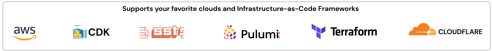

<div align="center">
  <a href="https://eventual.net">
    
  </a>
  <br />
  <h1>eventual</h1>
  <h3>
  Build scalable and durable micro-services with APIs, Messaging and Workflows.
  </h3>
  
  
  <a href="https://badge.fury.io/js/@eventual%2Fcore.svg">
    
  </a>
  <a href="https://github.com/eventual/eventual/blob/main/LICENSE">
    
  </a>
  <a href="https://discord.gg/8hfnTn3QDT">
    
  </a>
  <a href="https://twitter.com/EventualCloud">
    
  </a>
</div>

---

> 🛠&nbsp; Eventual is in pre-release - come chat to us on [Discord](https://discord.gg/8hfnTn3QDT)!

---

## Overview

**[Website](https://eventual.net/) • [API Docs](https://docs.eventual.net) • [Quick Start](https://docs.eventual.net/getting-started)**

Eventual is an open source TypeScript framework that offers "core abstractions" — including APIs, Messaging and long-running, durable Workflows — to shield you from the complexities of distributed systems and ensure a consistent, best-practice serverless architecture.

### Develop

- 🌎 **APIs** - expose RPC and REST endpoints
- 🚦 **Orchestration** - build long running, durable workflows using plain TypeScript - such as if-else, loops, functions, async/await, and all that goodness
- 💬 **Messaging** - publish and subscribe to events within and across service boundaries
- ✅ **End-to-end type safety** - from your frontend → backend → infrastructure

### Iterate

- 🧪 **Local Testing** - unit test with fine-grained control over timing to catch tricky edge cases
- 🤖 **Simulate** - run your massively distributed system, locally and deploy only when it's working
- 🐞 **Debug Production** - replay and debug production workflows from the comfort of your IDE

### Deploy

- 🛠 **Infrastructure as Code** - integrates directly into the AWS CDK, SST and Pulumi
- 🌩️ **Your Cloud** - runs in your own infrastructure and security boundaries
- 📈 **Serverless** - we shield you from the complexities of distributed systems and ensure a consistent, best-practice serverless architecture

<p align="center">
  
</p>

## Quick Start

Start a new project with Eventual or drop-in to an existing AWS CDK or SST application by visiting the [Quick Start](https://docs.eventual.net/getting-started).

```sh
# create a new project
npm create eventual

# enter the new project's directory
cd <project-name>

# deploy to AWS
npm run deploy
```

## Examples

- [Eventual Example Repository](https://github.com/functionless/eventual-examples) - a collection of eventual projects to help you get a feel and orient yourself around the programming model
- Event-Driven-Architecture Patterns (Coming Soon) - a collection of patterns for event-driven-architectures and domain-driven-design, inspired by https://serverlessland.com/event-driven-architecture/visuals and implemented with Eventual.

## How it works

Eventual offers "core abstractions" for distributed systems that are mapped to AWS Serverless Resources. These primitives include Commands, Events, Subscriptions, Workflows, Activities, Signals and Actors (coming soon). They provide a simple, consistent and type-safe programming model for micro-services.

The top-level concept of Eventual is a Service that be deployed to AWS with a CDK Construct. Each Service gets its own API Gateway, Event Bus, and Workflow Engine that you customize and build on using the core abstractions.

Eventual ships with its own Workflow Engine that deploys into your AWS account. It consists of purely serverless AWS Resources, such as an AWS SQS FIFO Queue, S3 Bucket, DynamoDB Table and Event Bridge Scheduler Group. This provides an abstraction for orchestrating long running, durable workflows using plain TypeScript - such as if-else, loops, functions, async/await, Promise.all, etc. This gives you an expressive, Turing complete way to implement business logic, however complex, distributed or time-dependent it may be.

The business logic of your Service (including APIs, Subscriptions, Activities, etc.) are discovered by analyzing your code and then optimally configuring AWS Resources for them. This includes optimal tree-shaking, bundling into individual Lambda Functions and providing supporting infrastructure such as Event Bus Rules, Dead Letter Queues, IAM Roles, etc.

## Why Eventual?

Eventual accelerates the development of distributed systems in the cloud with its fully integrated tool-chain.

You don't have to worry about low-level primitives such as concurrency control, scaling, or glueing individual AWS Resources together and managing all of their failure cases. Instead, you simply write your application in TypeScript and then deploy directly to AWS using your favorite IaC framework.

Eventual provides core abstractions that shield you from the complexities of distributed systems and ensure a consistent, best-practice serverless architecture with a slick and type-safe programming model.

Everything can be written and tested in a single TypeScript code-base. You can run your massively scalable distributed cloud system LOCALLY before you even deploy. Run, test and iterate locally, then deploy only when it’s working.

You can even debug production locally. Workflows running in production can be replayed locally and debugged from the comfort of your IDE.

Eventual supports customization and integration via IaC. Our Construct provides best practices out of the box but you are free to override and configure according to your needs.

All of your data remains within your own AWS account and security boundaries. With broad strokes, you can apply your own security policies to the system, such as server-side or client-side encryption, minimally permissive IAM Policies, etc.

## Contact us

- [Eventual Home](https://eventual.net)
- [Twitter](https://twitter.com/EventualCloud)
- [Discord](https://discord.gg/8hfnTn3QDT)

### Project Leads

- [Sam Goodwin](https://twitter.com/samgoodwin89)
- [Sam Sussman](https://twitter.com/sussmansa)
