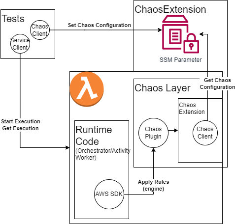

# Chaos Extension

Chaos Extension is an addition to Lambda which allows injecting failures into the AWS-SDK (and more later).

Without a deployment, it is able to selectively fail a single client command or all commands on a single client.

The behavior can be turned on and off at anytime, allowing a period of chaos before resuming normal operation.

This is intended to be used for testing only, never in production.

## Components



- SSM Parameter
- Client
- AWS-SDK plugin
- Lambda Layer and Extension

### SSM Parameter

The SSM Parameter is where the rules and state are stored, called the `ChaosTestConfig`.

### Chaos Client

The client wraps the SSM parameter, enabling the client to GET/PUT configuration. The client could be written for other storage mechanisms like Dynamo or AppConfig.

### AWS-SDK Plugin

We use the AWS-SDK middleware system to change the behavior of the SDK Clients during runtime. The Chaos Plugin adds a middleware to the initialize phase. When a request comes into the client with the plugin enabled, we use the `ChaosEngine` to determine if we should do something like reject the request.

### Chaos Layer and Extension

To enable retrieving new configuration while the lambdas are running, we use an Internal Lambda Extension deployed via a Lambda Layer.

The layer code (including the client, plugin, and wrapper-script) are bundled using `esbuild` and then deployed to the layer.

The [wrapper-script](https://docs.aws.amazon.com/lambda/latest/dg/runtimes-modify.html#runtime-wrapper) customizes how lambda starts node, allowing us to
inject in the `--require` parameter.

> Note: this should be possible using `NODE_OPTIONS`, but `--require` was always throwing module not found.

When the extension started in the node preload (`--require`), it registers the internal extension and asks for all of the INVOKE events.

Each time an INVOKE happens, we pull down the current state of the `ChaosTestConfig` from the SSM Parameter. This config is made available to the plugin
because the node process shares the same modules between preload and the runtime.

## Use in Testing

### In CDK

```ts
const chaos = new ChaosExtension(stack, "chaos");
const testService = new Service(...);
// a role used by the tests
const testRole = new Role(...);

// wire in the layer/extension to the service lambdas
chaos.addToFunction(testService.workflows.orchestrator);
chaos.addToFunction(testService.tasks.worker);
chaos.grantReadWrite(testRole);
```

### In Tests

```ts
const client = new ChaosClient(paramName, new SSMClient());
client.addRule({
  targets: [ChaosTargets.command("PutObjectCommand", "S3Client")],
  effect: ChaosEffects.reject(),
});
client.enable();
// start workflows
// wait for some time
// disable the chaos extension to allow the tests to pass.
client.disable();
```
