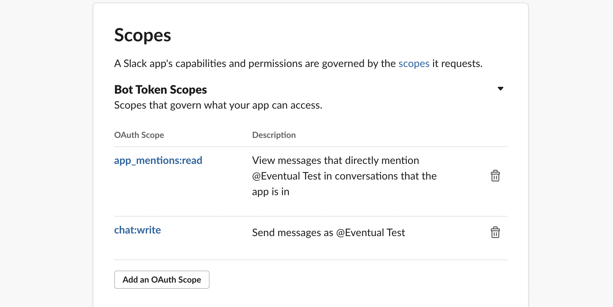
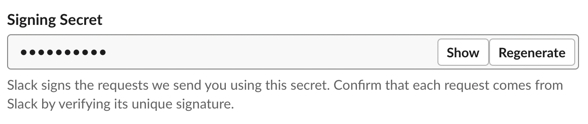
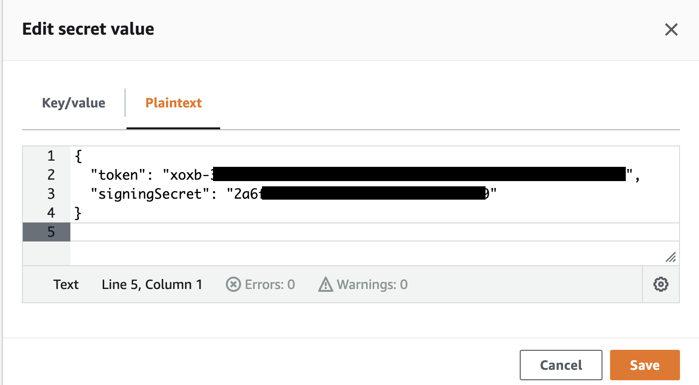
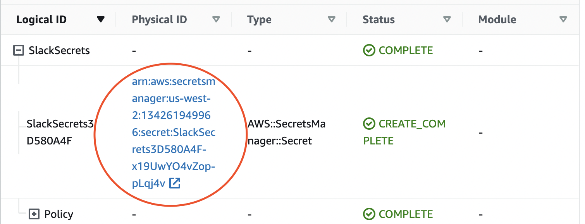

# @eventual/integrations-slack

This package provides a library for integrating with the Slack service. You can subscribe to webhooks from Slack and interact directly with the Slack API from within Eventual. To use this package, you will need to create a Slack application and grant the necessary OAuth permission scopes. You will also need to store the bot token and signing secret in a secure location. Then, you can instantiate the Slack class within your Eventual application and implement the desired integration logic. For example:

```ts
// subscribe to message events from slack
slack.message(async ({ body, say }) => {
  // do something when a message is sent
  await say("hello world");
});

// post a message to the slack API from within a workflow
const myWorkflow = workflow("my-workflow", async () => {
  await slack.client.chat.postMessage({
    channel: "channel-name",
    text: "hello world!",
  });
});
```

# Usage

The `@eventual/integrations-slack` package provides a class called `Slack` that can be used within your Eventual application. To use it, you must first instantiate it with a unique name and Slack credentials:

```ts
const slack = new Slack("my-slack-connection", {
  credentials: new JsonSecret<SlackCredentials>(
    new AWSSecret({
      secretId: process.env.SLACK_SECRET_ARN!,
    })
  ),
});
```

The unique name, my-slack-connection, constructs the endpoint URL that you will need to configure your Slack Application to route events to your bot. For example, the URL of the integration will be:

```
https://<your-api-endpoint>/_slack/my-slack-connection/events
```

Note that `my-slack-connection` is just an example and you can use any unique name for your integration. The `SlackCredentials` contain your application's `token` and `signingSecret`, which are required by your bot to authenticate and verify Slack API requests. In this example, we're using an `AWSSecret` to fetch the credentials from AWS Secrets Manager. However, this will vary depending on your choice of infrastructure (see the [Configure your Infrastructure](#configure-your-infrastructure) docs).

Once you have instantiated the `Slack` class, you can use it to listen for events in Slack. For example, you can use the `slack.message` hook to do something when a message is sent:

```ts
slack.message(async ({ body, say }) => {
  // do something when a message is sent
  await say("hello world");
});
```

You can also interact with the Slack API using the client, for example from within a Workflow:

```ts
// post a message to the slack API from within a workflow
const myWorkflow = workflow("my-workflow", async () => {
  await slack.client.chat.postMessage({
    channel: "channel-name",
    text: "hello world!",
  });
});
```

Eventual's slack integration is built on top of the official [Bolt-JS framework](https://slack.dev/bolt-js/concepts) provided by Slack. For example, the `slack.message` hook is identical to the `app.message `concept from Bolt. To learn more about the different capabilities, we recommend reviewing their documentation.

# Setup

Setup can be done in 4 simple steps:

1. Create a Slack Application
2. Grant the OAuth Permission Scopes required by your integration
3. Store the Bot Token and Signing Secret in a secure store
4. Configure your infrastructure with the credentials
5. Instantiate a `Slack` integration in your app and implement integration logic

## Create a Slack Application

To get started, first create an App for your integration by following the [official documentation](https://slack.com/intl/en-in/help/articles/115005265703-Create-a-bot-for-your-workspace).

# OAuth Permission Scopes

After creating an App, grant the OAuth permission scopes required by your application.

For a list of all available scopes, see: https://api.slack.com/scopes

As an example, an app might need `app_mentions:read` and `chat:write` to list to chat and respond with messages:



# OAuth Token and Signing Secret

The bot's OAuth Token is used to authenticate and authorize requests from your Bot. To find the token, navigate to the "OAuth & Permissions" tab on the side-bar and then scroll down to the "OAuth Tokens for Your Workspace" section.


The Signing Secret is used to verify the a request from slack is authentic. To find the token, navigate to the "Basic Information" page of your application, then down to the "App Credentials" section and copy the "Signing Secret" value.



For more documentation, see the [access tokens](https://api.slack.com/authentication/token-types) and [verifying requests from slack](https://api.slack.com/authentication/verifying-requests-from-slack) documentation.

# Store the credentials

Next you need to securely store the Token and Signing Secret and provide it to our Bot as a JSON document with the following format:

```json
{
  "token": "<bot-token>",
  "signingSecret": "<signing-secret>"
}
```

Copy the bot token and signing secret you copied in the previous step into a JSON file and proceed to the [Configure your infrastructure](#configure-your-infrastructure) section below for specific instructions on how to store this data in your infrastructure.

# Configure your infrastructure

## AWS CDK

In AWS, there are two supported methods for securely storing secrets:

1. an AWS Secrets Manager Secret (aka. Secret)
2. an AWS Systems Manager Secure Parameter (aka. Secure Parameter)

### Secret

To create a Secret from the AWS CDK use the `aws_secretsmanager.Secret` Construct:

```ts
// create the Secret using the CDK and CloudFormation
const slackSecrets = new aws_secretsmanager.Secret(stack, "SlackSecrets");

const slackBot = new eventual.Service(stack, "slack-bot", {
  name: "slack-bot",
  entry: require.resolve("test-app-runtime/lib/slack-bot.js"),
  environment: {
    // pass the Secret ARN to the service's environment
    SLACK_SECRET_ID: slackSecrets.secretArn,
  },
});

// grant the service permission to read the secret
slackSecrets.grantRead(slackBot);
```

Create the Secret by deploying your application:

```
cdk deploy
```

Go to the AWS Console and store the secret JSON as the value in your Secret:



A neat trick for finding your Secret is to go to your Stack in the CloudFormation UI.


Click on your Stack's name to see the tree of Resources in your Stack and browse to find your Secret (in this case ours is called `SlackSecrets`):


Expand the `SlackSecrets` section and then click on the link to navigate directly to your Secret in the Console:



### Secure Parameter

An AWS Systems Manager Secure Parameter cannot be created via the CDK or CloudFormation, but this option is often preferable over a Secret since it's significantly cheaper. To use a SSM Parameter, you'll have to create it in the AWS Console. For more information, see the official [Systems Manager Parameter Store documentation](https://docs.aws.amazon.com/systems-manager/latest/userguide/systems-manager-parameter-store.html).

TODO: step-by-step guide on how to integrate this into the AWS CDK using imports
