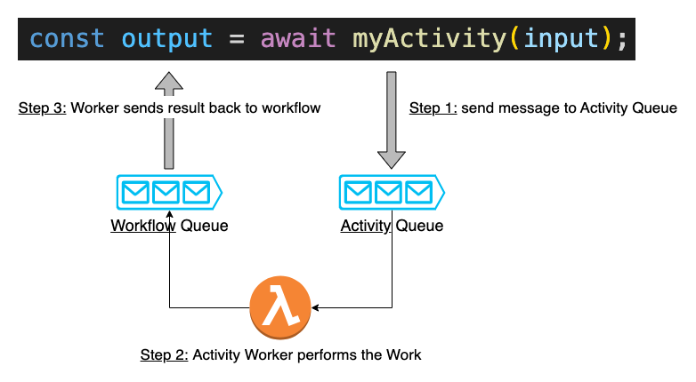

# Workflow

Workflows are programs that coordinate complex business processes, including calling APIs, coordinating time-based actions, and interacting with humans. They are designed to be reliable and durable, allowing them to execute over long periods of time and recover from failures. Workflows are particularly useful for orchestrating the interactions between various systems and components, serving as the "glue" that holds everything together.

## Create a `workflow`

To create a workflow, you can use the `workflow` function from the `@eventual/core` library. This function takes two arguments: a unique name for the workflow, and an implementation function that contains the logic of the workflow. The implementation function should be asynchronous, as it may involve waiting for external events or operations to complete.

Here is an example of how to create a workflow using the workflow function:

```ts
import { workflow } from "@eventual/core";

const myWorkflow = workflow("myWorkflow", async () => {
  // implementation of the workflow goes here
});
```

## Start Execution

To start an execution of a workflow, you can call the `startExecution` method on the workflow object, passing it an input argument. This will return an `ExecutionHandle`, which is a reference to the running workflow execution.

```ts
const execution = await myWorkflow.startExecution(input);
```

## Execution Handle

The ExecutionHandle allows you to get the current status of the execution and send signals to it.

### Get the status of an Execution

You can use the `getStatus` method to get the current status:

```ts
const status = await execution.getStatus();
```

### Send a signal to a running Execution

The `sendSignal` method is used to send a signal to the execution:

```ts
// using a signal's name
await execution.sendSignal("mySignal", "data");

// using a reference to a signal object
await execution.sendSignal(mySignal, "data");
```

## Call an Activity

A workflow can perform work by calling activities, which are functions that perform specific tasks such as calling APIs, interacting with databases, or executing complex computations. To call an activity from within a workflow, you can simply invoke the activity function as you would any other function.

Here is an example of a workflow that calls an activity:

```ts
const myWorkflow = workflow("myWorkflow", async (input: any) => {
  const message = await myActivity();
  return message;
});

const myActivity = activity("myActivity", async () => {
  return "hello world";
});
```

In this example, the workflow calls the `myActivity` function and waits for the result before continuing. The `myActivity` function, in turn, performs some work and returns a value to the workflow.

Activities are a key component of workflows, as they allow the workflow to perform complex tasks and interact with external systems. When you want a workflow to perform specific work, you can define an activity to handle that work and call it from within the workflow.

## Call another Workflow

Workflows can call other workflows as a part of their execution, sometimes referred to as "starting a child workflow". The call will return a Promise that will resolve once the workflow completes.

```ts
const workflowA = workflow("workflowA", async () => {
  // call the child workflow
  const result = workflowB(["hello", "world"]);

  // ..
});

const workflowB = workflow("workflowB", async (items: string[]) => {
  return Promise.all(items.map(myActivity));
});
```

To wait for the result of the child workflow, you can use the await keyword:

```ts
const result = await workflowB(["hello", "world"]);
```

If the child workflow fails, an Error is thrown. You can catch this error with a try-catch block:

```ts
try {
  await workflowB(["hello", "world"]);
} catch (err) {
  // handle error
}
```

## Publish an Event

Workflows can publish events to the Service's Event Bus by calling [`publishEvent`](./event.md#publish-an-event).

```ts
const myEvent = event("myEvent");

const myWorkflow = workflow("myWorkflow", async () => {
  await myEvent.publishEvent({
    key: "value",
  });
});
```

Keep in mind that the publish method returns a `Promise` that resolves once the event has been published. You can use the `await` keyword to wait for the event to be published before continuing with the rest of the workflow's execution - or leave it as dangling as an optimization:

```ts
// pause execution until the event has been sent
await myEvent.publishEvent( .. )

// publish but don't wait
myEvent.publishEvent( .. )
```

## Wait for a `signal`

Sometimes it may be necessary for a workflow to wait for external input from another system before continuing. In Eventual, this type of input is called a **Signal**.

To define a signal, you can use the `signal` function from the `@eventual/core` library. This function takes a unique name for the signal and an optional type argument defining the schema of the signal payload. The name of the signal must be unique within the service.

Here is an example of how to define a signal:

```ts
import { signal } from "@eventual/core";

const mySignal = signal<string>("mySignal");
```

A workflow can use the `expectSignal` method on the signal object, e.g. `mySignal.expectSignal()`, to pause execution until the signal is received for the current execution.

```ts
workflow("myWorkflow", async () => {
  const signalPayload = await mySignal.expectSignal();
});
```

You can specify a timeout in seconds when calling expect. If the signal is not received within the specified time, the method will throw a `Timeout` error.

```ts
try {
  const signalPayload = await mySignal.expectSignal({
    timeoutSeconds: 10,
  });
  // signal was received
} catch (err) {
  // timed out
}
```

## Handle a `signal`

To handle a signal within a workflow, you can use the `on` method, which takes a function that will be called every time the signal is received. You can then use the `dispose` method to disable the signal handler when it is no longer needed.

```ts
const mySignalHandler = mySignal.onSignal((signalPayload) => {
  // Handle the signal
});

// Disable the signal handler
mySignalHandler.dispose();
```

## Sleep

The `@eventual/core` library provides three methods for pausing an execution:

### `sleepFor` X seconds

The `sleepFor` function allows you to pause the execution of a workflow for a specified number of seconds. For example:

```ts
import { sleepFor } from "@eventual/core";

await sleepFor(10);
```

### `sleepUntil` a specific ISO timestamp

The `sleepUntil` function allows you to pause the execution of a workflow until a specific time, specified as an ISO8601 formatted string or as a `Date` object. For example:

```ts
await sleepUntil("2013-01-01T00:00:00.000Z");

await sleepUntil(new Date(epochMilliseconds));
```

### `condition` a condition is true

The `condition` function will pause execution until a predicate function returns `true`.

```ts
let isCancelled = false;

await condition(() => !isCancelled);
```

The predicate is evaluated whenever the workflow progresses, such as when an event is received. For example, in the previous example, a signal could be used to set `isCancelled` to `true`. When that signal is received, the condition will be re-evaluated as `false`, allowing the function to continue.

```ts
cancelSignal.onSignal(() => (isCancelled = true));

await condition(() => !isCancelled);
// execution will proceed after the signal is received
```

## Patterns

See the [Workflow Patterns](../cheatsheet.md) for a cheatsheet of patterns for building workflows.

## Runtime Semantics

A workflow function is a program that executes in a durable, long-running manner. It differs from API/event/activity handlers, which are invoked for a single execution and do not have the same runtime guarantees.

To carry out an activity, the workflow function enqueues a message on an internal message bus. A worker listening to that queue then performs the activity and sends a message back to the workflow function with the result. This process allows the workflow to execute operations in a reliable manner, as each operation is guaranteed to be executed exactly once, even in the event of intermittent failures.



The use of an internal message bus and worker process helps to eliminate the risk of failure inherent in single-invocation runtimes such as Lambda functions or containers, which can crash, timeout, or reboot at any time. By contrast, a workflow function is able to continue executing and resuming even in the face of such failures, making it a more durable and reliable runtime for long-running or business-critical processes.


## Durable Execution with Event Sourcing and Re-entrancy

Event sourcing and re-entrancy allow a workflow function to execute in a durable, long-running manner.

Event sourcing involves recording every action taken within a workflow as an event in the workflow's event log. This log is then used to replay the workflow's execution whenever a decision needs to be made, a process known as re-entrancy. During replay, the workflow function processes each event in the log in order. If an event has already been recorded in the log, it is considered to have already been performed and is skipped over. If an event has not been recorded, it is enqueued for execution and the workflow function suspends until it is completed.


This ensures that each action taken by the workflow is performed exactly once, even in the face of intermittent failures. By using event sourcing and re-entrancy, a workflow function is able to provide strong runtime guarantees and execute in a reliable manner, making it suitable for long-running and failure-sensitive processes. Actions that are recorded in the event log include executing an activity or another workflow, waiting for a signal, publishing events, etc.

## Deterministic Constraints

A consequence of the event sourcing and re-entrant techniques is that a workflow function's logic must be deterministic and backwards compatible.

This means that any operation that could produce different results each time it is called, such as generating a UUID or random number, accessing a database, or getting the system time, must be performed via an activity rather than being called directly within the workflow.

```ts
workflow("foo", async () => {
  const id = uuid(); // not allowed - not deterministic
  const time = new Date(); // not allowed - not deterministic
  await fetch("http://google.com"); // not allowed - not deterministic
});
```

When making changes to a workflow function and redeploying it, it is important to ensure that those changes are backwards compatible with already-running executions. This means that the order of operations should not be changed and no operations should be removed.

For example, imagine a workflow that calls two activities in sequence, `bar` and then `baz`:

```ts
workflow("foo", async () => {
  await bar();
  await baz();
});
```

The following change is valid because the order in which they execute is un-changed:

```ts
await Promise.all([bar(), baz()]);
```

But re-arranging the order is invalid:

```ts
await baz();
await bar();
```

Removing one of the calls is also invalid:

```ts
await baz();
```

## Syntax Constraints

Any syntax, such as if-else, while, functions, etc. are supported.

### Everything must be defined inside the workflow closure

Tracking: https://github.com/functionless/eventual/issues/146

The only constraint is that the workflow's logic must be entirely encapsulated within the closure - you cannot call an `async function` that is defined outside of the `workflow`.

```ts
workflow("myWorkflow", async () => {
  // not allowed
  await foo();
});

// invalid: to call this from a workflow, it must be defined within the `workflow` closure
async function foo() {
  // ..
}

workflow("myWorkflow", async () => {
  await foo();

  // valid: defined inside the workflow closure
  async function foo() {
    // ..
  }
});
```
