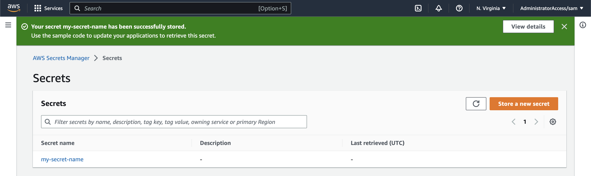
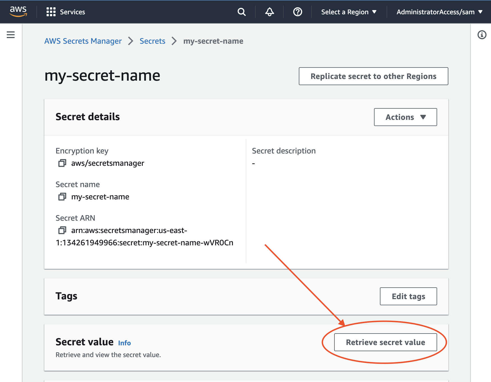
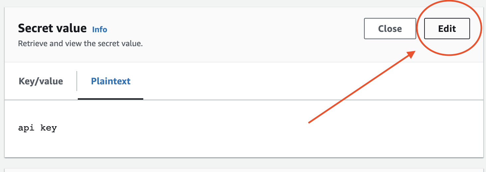
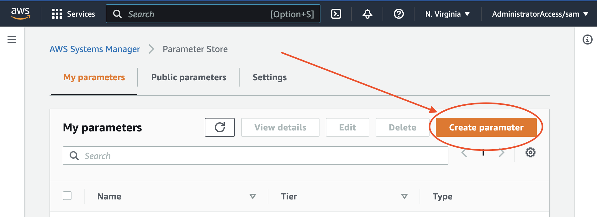
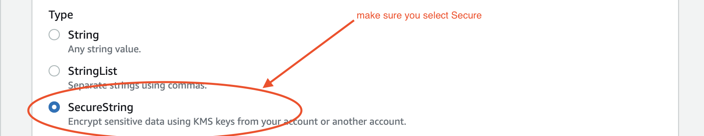
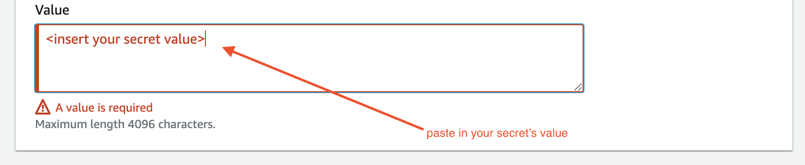
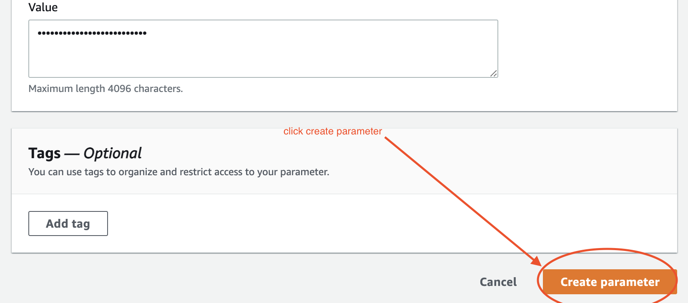

# Use a Secret in a Service

Many use-cases require access to secrets such as API keys or database passwords. For example, you may need to securely store and access the API key for an external service such as Shopify or a SQL Database password.

## Storage options in AWS

Eventual leverages AWS to securely store and retrieve Secret values. There are two ways to achieve this in AWS:

1. [Creating and retrieving a Secret with AWS Secrets Manager](#creating-and-using-an-aws-secret)
2. [Creating and retrieving a Secure Parameter with Systems Manager](#creating-an-retrieving-a-secure-parameter-with-systems-manager)

<details>
<summary>
Expand for help choosing between an AWS Secret or a Secure System Parameter.
</summary>

- Secrets Manager supports rotating credentials as a part of a lifecycle, where System Parameters only supports storing the value.
- Secrets Manager has a minimum cost for each Secret (regardless of whether it's being used):
  - A Secret costs $0.40 per secret per month and $0.05 per 10,000 API calls.
  - A Secure System Parameter has no fixed cost and costs $0.05 per 10,000 Parameter Store API interactions
- It is not possible to create a Secure Parameter with the AWS CDK or CloudFormation - you will have to manually create it through the AWS CLI, Console or SDK. It is possible to automatically create a Secret with CloudFormation, but you will still have to upload the value manually after creating the Resource.

</details>

## Creating and retrieving a Secret with AWS Secrets Manager

For more information, see the [AWS Secrets Manager Documentation](https://aws.amazon.com/secrets-manager/).

### 1. Add a `Secret` into your Stack

To create an AWS Secret with the AWS CDK, import the [`aws_secretsmanager`](https://docs.aws.amazon.com/cdk/api/v1/docs/aws-secretsmanager-readme.html) module and instantiate a `Secret` Resource in your Service's Stack:

```ts
import { aws_secretsmanager } from "aws-cdk-lib";

class MyServiceStack extends Stack {
  constructor(scope: Construct, id: string) {
    super(scope, id);

    const secret = new aws_secretsmanager.Secret(this, "MySecret", {
      // optionally provide a name for the Secret
      secretName: "my-secret-name",
    });
  }
}
```

Alternatively, you can import an existing Secret (see the official [Importing Secret Docs](https://docs.aws.amazon.com/cdk/api/v1/docs/aws-secretsmanager-readme.html#importing-secrets) for more information).

```ts
const secret = aws_secretsmanager.Secret.fromSecretCompleteArn(this, "MySecret", <my-secret-arn>);
```

### 2. Add the Secret's ARN to the Service's Environment Variables

Use the `addEnvironment` method to add the Secret's ARN into the Service's environment variables. We need this to get the Secret Value in [Step 7](#7-update-your-service-code-to-fetch-the-secret) and [Step 8](#8-add-a-function-to-get-the-secret-value).

```ts
myService.addEnvironment("MY_SECRET_ARN", secret.secretArn!);
```

### 3. Grant the Service permissions to read the Secret Value

Use the `grantRead` method to grant your Service's IAM Policy permission to read the Secret Value.

```ts
secret.grantRead(myService);
```

### 4. Deploy your Service

Create the new Secret by re-deploying your application to AWS.

import Tabs from "@theme/Tabs";
import TabItem from "@theme/TabItem";
import CodeBlock from "@theme/CodeBlock";

<Tabs groupId="npm">
  <TabItem value="apple" label="npm" default>
    <CodeBlock>npm run deploy</CodeBlock>
  </TabItem>
  <TabItem value="orange" label="yarn">
    <CodeBlock>yarn deploy</CodeBlock>
  </TabItem>
  <TabItem value="banana" label="pnpm">
    <CodeBlock>pnpm run deploy</CodeBlock>
  </TabItem>
</Tabs>

### 5. Upload the Secret to the newly created

```
aws put-secret-value --secret-id <secret-id> --secret-string <secret-value>
```

For example, to upload the secret value for our newly created Secret named `my-secret-name`:

```
aws put-secret-value --secret-id my-secret-name --secret-string abc123
```

Alternatively, you can use the AWS Console.

<details><summary>Click to see how to edit a Secret Value with the AWS Console</summary>

First, go to the [AWS Secrets Manager Console](https://us-east-1.console.aws.amazon.com/secretsmanager/listsecrets?region=us-east-1) and find your new Secret.



Click on the secret and then click on Retrieve Secret.



This will open a UI to edit the value of the secret. Click Edit.



Paste in the value of the secret and click Save.


</details>

### 6. Add a dependency on `@aws-sdk/client-secrets-manager` to your Service

Add a dependency on [`@aws-sdk/client-secrets-manager`](https://docs.aws.amazon.com/AWSJavaScriptSDK/v3/latest/clients/client-secrets-manager/index.html) in your service's `package.json`, e.g. within `services/package.json`:

<Tabs groupId="npm">
  <TabItem value="apple" label="npm" default>
    <CodeBlock>npm install --save @aws-sdk/client-secrets-manager</CodeBlock>
  </TabItem>
  <TabItem value="orange" label="yarn">
    <CodeBlock>yarn add @aws-sdk/client-secrets-manager</CodeBlock>
  </TabItem>
  <TabItem value="banana" label="pnpm">
    <CodeBlock>pnpm install --save @aws-sdk/client-secrets-manager</CodeBlock>
  </TabItem>
</Tabs>

### 7. Import and instantiate a `SecretsManagerClient`

In your service code, import the [`@aws-sdk/client-secrets-manager`](https://docs.aws.amazon.com/AWSJavaScriptSDK/v3/latest/clients/client-secrets-manager/index.html) module and instantiate a new `SecretsManagerClient`:

```ts
import { SecretsManagerClient } from "@aws-sdk/client-secrets-manager";

const secretClient = new SecretsManagerClient({});
```

### 8. Add a function to get the Secret Value

Import and send a [`GetSecretValueCommand`](https://docs.aws.amazon.com/AWSJavaScriptSDK/v3/latest/clients/client-secrets-manager/classes/getsecretvaluecommand.html) to get the secret value at runtime.

It's useful to extract this out into its own function which caches the value to avoid fetching the value multiple times:

```ts
import { GetSecretValueCommand } from "@aws-sdk/client-secrets-manager";

let _mySecret: string | undefined;
async function getMySecret(): Promise<string> {
  if (!_mySecret) {
    // get the Secret Arn from the environment variables
    // note: we injected this with the addEnvironment method in our CDK stack
    const secretArn = process.env.MY_SECRET_ARN;
    if (secretArn === undefined) {
      // throw an error if we forgot to set the variable
      throw new Error(`environment variable 'MY_SECRET_ARN' is not set`);
    }
    // get the secret value from the secret
    const response = await secretClient.send(
      new GetSecretValueCommand({
        SecretId: secretArn,
      })
    );
    // store the value
    _mySecret = response.SecretString!;
  }
  return _mySecret;
}
```

### 9. Update your API, Event or Activity to get the Secret

```ts
api.post("/", async () => {
  const mySecretValue = await getMySecret();
  // ..
});

myEvent.onEvent(async () => {
  const mySecretValue = await getMySecret();
  // ..
});

const myActivity = activity("myActicity", async () => {
  const mySecretValue = await getMySecret();
  // ..
});
```

## Creating an retrieving a Secure Parameter with Systems Manager

For more information, see the [AWS Systems Manager Parameter Store Documentation](https://docs.aws.amazon.com/systems-manager/latest/userguide/systems-manager-parameter-store.html).

### 1. Create a Secure Parameter and upload the Secret Value

CloudFormation does not support creating a Secure Parameter, so we must first create it using the AWS CLI or the AWS Console.

To create a Secure Parameter using the default AWS managed key, use the following command:

```
aws ssm put-parameter --type SecureString --name my-secret --value "my-secret-value"
```

For more information (and options), see the official [Create a SecureString parameter (AWS CLI)](https://docs.aws.amazon.com/systems-manager/latest/userguide/param-create-cli.html#param-create-cli-securestring) docs.

Alternatively, you can create the Parameter with the AWS Console.

<details>
  <summary>
    Click to see how to create a Secure System Parameter with the AWS Console
  </summary>
  First, go to the [AWS Console for Systems Manager](https://us-east-1.console.aws.amazon.com/systems-manager/parameters/?region=us-east-1&tab=Table) and click Create Parameter.



Give your Parameter a name and choose the Tier. Leave it as the default Standard Tier unless you know you need Advanced. For more information on Tiers, see the [Managing parameter tiers](https://docs.aws.amazon.com/systems-manager/latest/userguide/parameter-store-advanced-parameters.html) documentation.


Most importantly, select the `SecureString` Type. If you don't, then the secret will not be securely stored and encrypoted, leaving you vulnerable to attacks.



Paste the value of your secret.



Finally, click Create Parameter to create and save the parameter.



</details>

### 2. Import the Parameter into your Stack

Use the `fromSecureStringParameterAttributes` method to import the Parameter into your CDK application.

```ts
import { aws_ssm } from "aws-cdk-lib";

const secretParam = aws_ssm.StringParameter.fromSecureStringParameterAttributes(
  this,
  "my-secret",
  {
    parameterName: "my-secret-name",
  }
);
```

### 3. Grant your Service Read permissions

Use the `grantRead` method to grant your Service's IAM Policy permission to read the Parameter's Value.

```ts
secretParam.grantRead(myService);
```

### 4. Put the Parameter's Name in the Environment Variables

```ts
myService.addEnvironment("MY_SECRET_PARAM_ARN", secretParam.parameterArn);
```

### 5. Add a dependency on @aws-sdk/client-ssm to your Service

Add a dependency on [@aws-sdk/client-ssm](https://docs.aws.amazon.com/AWSJavaScriptSDK/v3/latest/clients/client-ssm/index.html) in your service's package.json, e.g. within services/package.json:

<Tabs groupId="npm">
  <TabItem value="apple" label="npm" default>
    <CodeBlock>npm install --save @aws-sdk/client-ssm</CodeBlock>
  </TabItem>
  <TabItem value="orange" label="yarn">
    <CodeBlock>yarn add @aws-sdk/client-ssm</CodeBlock>
  </TabItem>
  <TabItem value="banana" label="pnpm">
    <CodeBlock>pnpm install --save @aws-sdk/client-ssm</CodeBlock>
  </TabItem>
</Tabs>

### 6. Import and instantiate a `SSMClient`

```ts
import { SSMClient } from "@aws-sdk/client-ssm";

const ssmClient = new SSMClient({});
```

### 7. Add a function to get the Parameter value

Import and send a [`GetParameterCommand`](https://docs.aws.amazon.com/AWSJavaScriptSDK/v3/latest/clients/client-ssm/classes/getparametercommand.html) to get the Parameter's value at runtime.

It's useful to extract this out into its own function which caches the value to avoid fetching the value multiple times:

```ts
import { GetParameterCommand } from "@aws-sdk/client-ssm";

let _mySecret: string | undefined;
async function getMySecret(): Promise<string> {
  if (!_mySecret) {
    // get the Parameter's ARN from the environment variables
    // note: we injected this with the addEnvironment method in our CDK stack
    const paramArn = process.env.MY_SECRET_PARAM_ARN;
    if (paramArn === undefined) {
      // throw an error if we forgot to set the variable
      throw new Error(`environment variable 'MY_SECRET_ARN' is not set`);
    }
    // get the secret value from the secret
    const response = await ssmClient.send(
      new GetParameterCommand({
        Name: paramArn,
        // if this is omitted then the value will not be decrypted
        WithDecryption: true,
      })
    );
    // cache the value
    _mySecret = response.Parameter?.Value!;
  }
  return _mySecret;
}
```

### 8. Update your API, Event or Activity to get the Secret

```ts
api.post("/", async () => {
  const mySecretValue = await getMySecret();
  // ..
});

myEvent.onEvent(async () => {
  const mySecretValue = await getMySecret();
  // ..
});

const myActivity = activity("myActicity", async () => {
  const mySecretValue = await getMySecret();
  // ..
});
```
