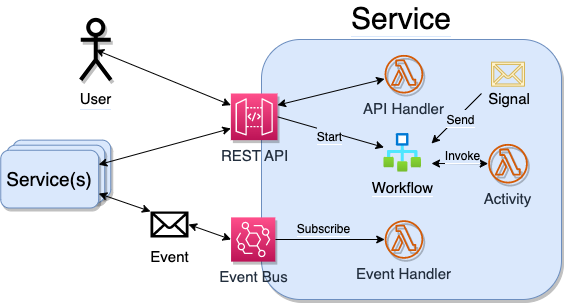

# Introduction

Welcome to Eventual!

Eventual is a code-first service and software development kit (SDK) that helps developers create event-driven systems using modern infrastructure-as-code. Its composable service model is designed for building and evolving microservice architectures, providing a set of libraries and APIs that abstract away the complexities of distributed systems, allowing developers to focus on the business logic of their services.

## Getting Started

- [Getting Started](./getting-started.mdx) - set up a new project, deploy it to the cloud and test it out.

## Building Blocks

- [Service](./guide/service.md) - a collection of APIs, Events, Workflows, and Activities that represent a business domain or capability. Can be composed with other services via APIs and Event subscriptions.
  
- [REST API](./guide/api.md) - create and your own REST APIs and serve them over HTTPS via a managed API Gateway. Each Service also includes internal API routes (see: [Eventual Service Client](./guide/service-client.md)).
- [Event](./guide/event.md) - publish and subscribe Events to your Service's Event Bus. Process events internally or route them to other Services.
- [Workflow](./guide/workflow.md) - a set of orchestrated Activities that implements business logic with asynchronous, durable long-running processes.
- [Activity](./guide/activity.md) - functions that encapsulate a single unit of work in a workflow. Integrate with cloud resources and SaaS.
- [Signal](./guide/signal.md) - a message that can be sent to a workflow execution. Workflows can wait for external input as a Signal and modify its behavior. Signals are communicated point-to-point in contrast to Events which are broadcast to all subscribers.

## Helpful Resources

- [Eventual Service Client](./guide/service-client.md) - a client for interacting with an Eventual Service, such as listing and starting workflows, viewing logs, etc.
- [CLI Guide](./guide/cli.md) - the Eventual command-line interface (CLI) provides tools for interacting with your service from the terminal.
- [Unit Testing](./guide/unit-testing.md) - API reference, guidelines and best practices for writing unit tests for your Eventual service.
- [Cheatsheet](./cheatsheet.md) - a list of helpful patterns for solving common problems using Eventual
- [Service Limits](./guide/service-scaling-limits.md) - the AWS Limits and Quotas to be aware of when scaling a Service.

## Tutorials

- [Bank Account Part 1](./tutorial/bank-account.md) - build a reliable bank account service for depositing and transferring money
